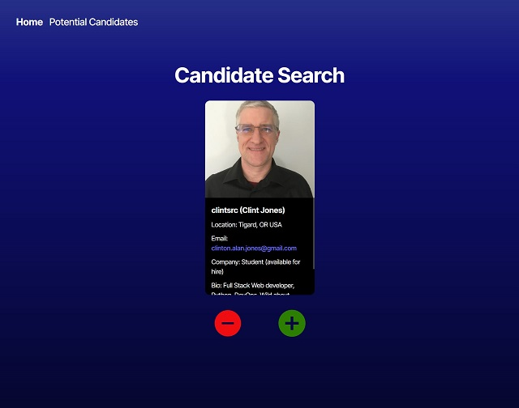

# Shark 

## Description

A candidate search application that calls the GitHub API and renders data in the browser.

## Table of Contents

- [Installation](#installation)
- [Usage](#usage)
- [License](#license)
- [Contributing](#contributing)
- [Tests](#tests)
- [Questions](#questions)

## Installation

1. Create a [GitHub Personal Access token](https://docs.github.com/en/authentication/keeping-your-account-and-data-secure/managing-your-personal-access-tokens#creating-a-fine-grained-personal-access-token).  
2. Add the token to an .env file in the environment folder as VITE_GITHUB_TOKEN. The included .env.EXAMPLE file can be used as an example.  
3. Change the project's root directory  
4. Install the dependency modules: npm install

## Usage

1. Change the project's root directory  
2. Run: npm run dev  
3. Browse to the running app at: http://localhost:3000/  
* See my active Shark site deployed on Render [here](https://shark-b07k.onrender.com/)  
Note that it takes a couple of minutes to spin up  

## License

This application is covered under the [MIT](https://opensource.org/licenses/MIT) license

## Contributing

Guidelines:  
Ensure your code follows the project's coding standards.  
Write clear and concise commit messages.  
If your changes include new features, please update the documentation accordingly.  
If you are fixing a bug, please include a test to verify the fix.  
Thank you for your contributions!
Here are some helpful resources:  
  
  

## Tests

Test instructions:  
1. Try using the reject and save buttons on the search page.  
2. On the saved page ensure the list is updated from the search page additons.  
3. Try the image and email links.  
4. Try removing candidates until the list is empty.  
5. Test the sort opton.  
6. Try filtering on text in one of the bio fields.  
7. Try filtering on a nonexisting text string.  
8. Clear the filter to be sure the saved candidates are visible again.

## Questions

If you have any questions, feel free to reach out: 
- GitHub: [clintsrc](https://github.com/clintsrc)  
- Email: clinton.alan.jones@gmail.com

